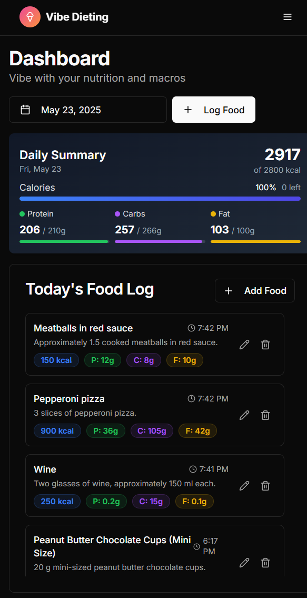

<!-- 
Website: https://www.vibedieting.xyz
Description: A lighthearted yet effective nutrition tracking app that uses AI to analyze your food through text or images
-->

# 🌟 Vibe Dieting - Your Chill Nutrition Tracking Companion

> Because tracking macros shouldn't feel like a chore! 🎉

[](https://www.vibedieting.xyz)
[](https://vercel.com/new/clone?repository-url=https://github.com/Emlembow/vibe-dieting)
[](LICENSE)

Vibe Dieting is a lighthearted yet effective nutrition tracking app that uses AI to analyze your food through text or images. Just snap a pic or type what you ate, and let our custom OpenAI assistant figure out the calories and macros for you. No more database diving or barcode scanning – just pure vibes! ✨

🌐 **[Try it live at vibedieting.xyz](https://www.vibedieting.xyz)**



## 🚀 Features

- **📸 Image Recognition**: Take a photo of your meal and get instant nutrition info
- **💬 Text Analysis**: Just type what you ate – our AI gets it
- **📊 Macro Tracking**: Track your proteins, carbs, and fats with style
- **🎯 Goal Setting**: Set and monitor your daily nutrition goals
- **📈 Trends Dashboard**: Visualize your progress over time
- **🌙 Modern UI**: Clean, responsive design that looks good on any device

## 🛠️ Tech Stack

- **Frontend**: Next.js 14, React, TypeScript, Tailwind CSS
- **Backend**: Next.js API Routes, Supabase
- **AI**: OpenAI Assistant API
- **UI Components**: shadcn/ui
- **Styling**: Tailwind CSS with custom themes

## 🏃‍♂️ Quick Start

### Prerequisites

- Node.js 18+ and pnpm (or npm/yarn)
- [Supabase](https://supabase.com) account (free tier works!)
- [OpenAI](https://platform.openai.com) API key
- A sense of humor and a love for good vibes 🎵

### 1. Clone the Repository

```bash
git clone https://github.com/yourusername/vibe-dieting.git
cd vibe-dieting
```

### 2. Install Dependencies

```bash
pnpm install
# or npm install
# or yarn install
```

### 3. Set Up Environment Variables

Copy the example environment file:

```bash
cp .env.example .env.local
```

Open `.env.local` and fill in your credentials:

```env
# OpenAI Configuration
OPENAI_API_KEY=sk-proj-your-openai-api-key-here
OPENAI_ASSISTANT_ID=asst_your-assistant-id-here

# Supabase Configuration
NEXT_PUBLIC_SUPABASE_URL=https://your-project.supabase.co
NEXT_PUBLIC_SUPABASE_ANON_KEY=your-anon-key-here
SUPABASE_SERVICE_ROLE_KEY=your-service-role-key-here
```

### 4. Set Up Your OpenAI Assistant

1. Go to [OpenAI Platform](https://platform.openai.com/assistants)
2. Create a new assistant with these settings:
   - **Name**: Vibe Dieting Nutrition Assistant (or your choice)
   - **Model**: GPT-4 or GPT-4 Turbo (recommended for image analysis)
   - **Temperature**: 0.3 (for consistent results)
3. **Configure Response Format** (Required!):
   - Enable "Response format" in the assistant configuration
   - Select `json_schema` as the format type
   - Copy the entire contents of `openai-assistant-schema.json` and paste it into the schema field
4. **Set Instructions**:
   - Copy the assistant instructions from `openai-assistant-prompt.md`
   - Paste them into the "Instructions" field
5. Save the assistant and copy the assistant ID
6. Add the assistant ID to your `.env.local` file

> ⚠️ **Important**: The JSON schema is required! Without it, the assistant responses won't match the expected format and the app will fail to parse nutrition data.

> 💡 **Files to Use**:
> - `openai-assistant-schema.json` - The JSON schema for structured responses
> - `openai-assistant-prompt.md` - The detailed instructions for the assistant

### 5. Set Up Supabase (Automated)

1. Create a new project on [Supabase](https://app.supabase.com)
2. Copy your Supabase project URL and keys to `.env.local`
3. Install Supabase CLI if you haven't already:
   ```bash
   npm install -g supabase
   ```
4. Set up the database with automated migrations:
   ```bash
   # Initialize Supabase (if not already done)
   npm run db:init
   
   # Link to your Supabase project
   npm run db:link --project-ref YOUR_PROJECT_REF
   
   # Push migrations to create tables and policies
   npm run db:push
   ```

> 🎉 **No more manual SQL!** The database schema and security policies are now automatically created using Supabase migrations.

**Alternative Manual Setup:**
If you prefer manual setup, you can still run the SQL from `supabase/migrations/` files in your Supabase SQL editor.

## 🚀 One-Click Deploy

Deploy directly to Vercel with automated database setup:

[](https://vercel.com/new/clone?repository-url=https://github.com/Emlembow/vibe-dieting)

**Post-Deploy Steps:**
1. Set up Supabase project and add environment variables in Vercel dashboard
2. Run database migrations: `npm run db:push`
3. Create OpenAI Assistant using project files

### 6. Run the Development Server

```bash
pnpm dev
# or npm run dev
# or yarn dev
```

Open [http://localhost:3000](http://localhost:3000) and start vibing! 🎉

## 🧪 Testing

Want to quickly test the app? Visit `/api/create-test-user` to create a test account with sample data:

- Email: `test@example.com`
- Password: `password123`

## 📱 Usage

1. **Sign Up/Login**: Create an account or use the test credentials
2. **Set Your Goals**: Head to the Goals page to set your daily calorie and macro targets
3. **Track Your Food**:
   - Click "Add Food" 
   - Either type what you ate or upload a photo
   - Let the AI work its magic ✨
4. **Monitor Progress**: Check your dashboard to see how you're doing
5. **View Trends**: See your nutrition patterns over time

## 🤝 Contributing

We love contributions! Whether it's fixing bugs, adding features, or improving the vibes, feel free to:

1. Fork the repository
2. Create your feature branch (`git checkout -b feature/amazing-feature`)
3. Commit your changes (`git commit -m 'Add some amazing feature'`)
4. Push to the branch (`git push origin feature/amazing-feature`)
5. Open a Pull Request

## 📝 License

This project is open source and available under the [MIT License](LICENSE).

## 🙏 Acknowledgments

- [shadcn/ui](https://ui.shadcn.com/) for the beautiful components
- [OpenAI](https://openai.com) for the amazing AI capabilities
- [Supabase](https://supabase.com) for the backend magic
- All the amazing contributors who help make this project better

## 💌 Support

Having issues? Found a bug? Want to suggest a feature? 

- Open an [issue](https://github.com/yourusername/vibe-dieting/issues)
- Open an [issue](https://github.com/yourusername/vibe-dieting/issues)

Remember: Life's too short for boring diet apps. Keep the vibes high and the macros balanced! 🌈

## ☕ Buy Me a Coffee

If you find Vibe Dieting helpful and want to support its development, consider buying me a coffee! Your support helps keep the vibes flowing and the features coming.

<a href="https://buymeacoffee.com/sm9j5qktnjv" target="_blank">
  
</a>

---

Made with 💜 and good vibes by the Vibe Dieting team